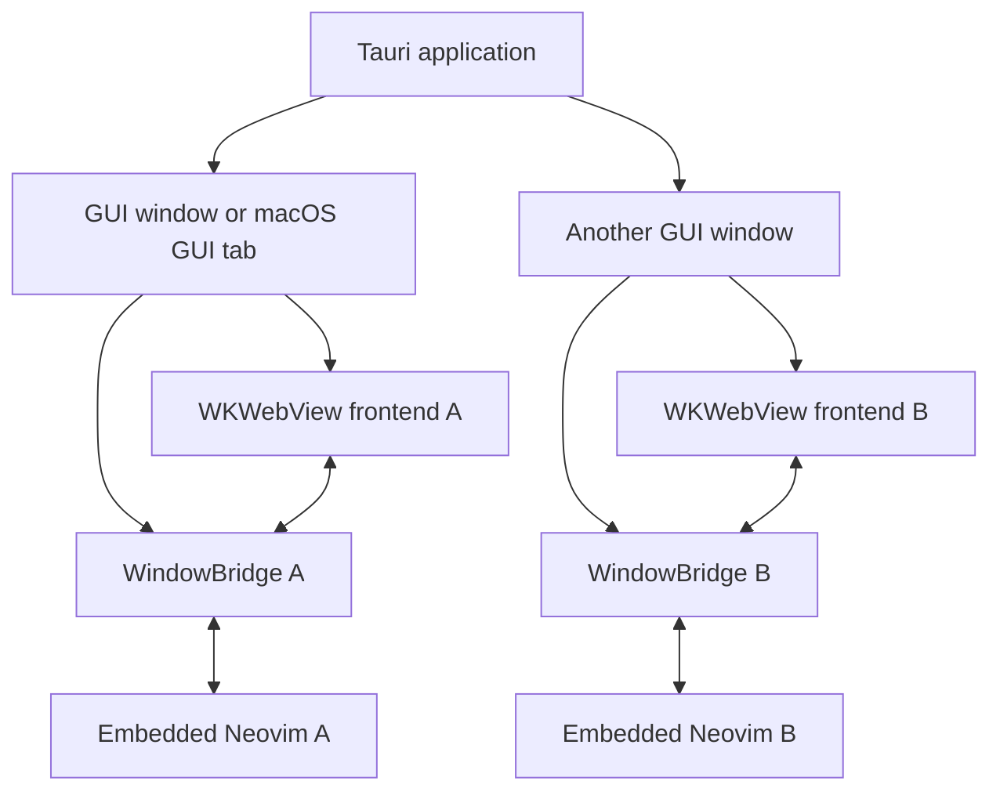
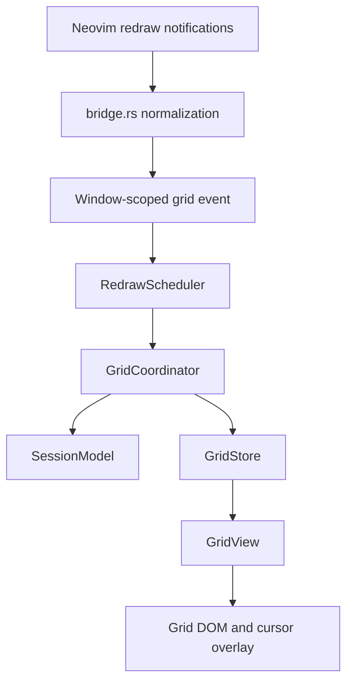

# Gneovim system architecture after the September 2026 refactor

## Purpose and Status

This document is the current architectural guide to gneovim after the refactoring described in `architecture-review-2026-09.md`. It explains the running system, identifies the modules that own important state and behaviour, compares the current codebase with the previous structure, and preserves the critical information scattered through the older notes in this directory.

The refactor was intentionally behaviour-preserving. It did not add, remove, or rename a Tauri command, Tauri event, Neovim notification, configuration option, editor feature, or visible rendering feature. The main change is that responsibilities which previously lived together in `src/main.js` now have explicit owners and tests.

The final automated baseline at completion is:

* 28 JavaScript test files and 91 passing tests
* 13 Rust unit tests
* passing bridge, multigrid renderer, and redraw probe integration tests against a real Neovim
* a passing Vite production build

Manual macOS checks remain necessary for IME composition, Accessibility clients such as Grammarly, AppKit tab and window behavior, and WKWebView compositor behavior.

## System infrastructure

### The process and window boundary

The unit of native application ownership is a Tauri window. Each ordinary GUI window and each macOS merged GUI tab is a separate `NSWindow` with:

1. its own WKWebView frontend,
2. its own generated Tauri window label,
3. its own `WindowBridge`,
4. its own `nvim --embed --headless` child process, and
5. its own msgpack RPC stream over the child's standard input and output.

A Neovim tabpage is not a GUI tab. Neovim tabpages and splits remain inside one Neovim process and are rendered as part of that process's multigrid UI. AppKit tab grouping only groups native windows visually; it does not merge their processes or state.

`AppState.windows` in the Rust shell associates each Tauri window label with the bridge and child process for that window. Tauri automatically supplies the calling window to commands, and `bridge_for` resolves the correct bridge from its label. Events are also scoped by label in names such as `gnv://gnv-1/grid`.

There is no WebSocket transport and no Neovim `--listen` socket in the current implementation. Embedded stdio is the only Neovim transport. A webview reload replaces the frontend projection but leaves its Rust `WindowBridge` and Neovim child alive. Closing the GUI window removes that bridge and ends the child after the close guard has handled modified buffers and terminal jobs.



### The Rust tier

The Rust tier has three main responsibilities.

#### Native shell and command boundary

`src-tauri/src/lib.rs` owns Tauri application setup, native windows and menus, macOS chrome, close and quit guards, event forwarding, configuration access, and the frozen Tauri command handlers.

Most command handlers are deliberately thin. Their value is not domain logic but the stable application boundary: they select the bridge belonging to the calling window, preserve the command parameter shape, and turn bridge errors into Tauri errors.

#### Neovim bridge

`src-tauri/src/bridge.rs` owns the Neovim child and msgpack RPC protocol. It:

* starts and initializes Neovim,
* installs the injected Lua runtime,
* translates Neovim notifications into typed `BridgeEvent` values,
* normalizes redraw operations into the frontend wire vocabulary,
* owns island buffer attachment and changedtick synchronization,
* obtains an atomic island snapshot,
* applies cursor, input, edit, mouse, resize, clipboard, and lifecycle requests, and
* reports terminal process or transport failure.

The bridge is intentionally independent of Tauri. Its event sender is its outward interface, which lets Rust integration tests drive a real headless Neovim without creating an application window.

The hot path is defensive. Poisoned mutexes recover their data rather than permanently panicking. Once the forwarding receiver is gone, the notification handler stops performing work for it. Bridge readiness is represented by a shared watch signal rather than repeated command specific polling.

#### Injected Lua

The files under `src-tauri/src/runtime/` are installed into each embedded Neovim.

* `md_preview.lua` owns the window local `w:gnv_md_preview` flag and the commands which change it.
* `md_decor.lua` observes Neovim's conceal, highlights, search state, folds, visual selection, structural Markdown ranges, and overlay virtual text, then emits one JSON decoration payload per window.
* `open_in_new_tab.lua` supports the native shell's file opening policy.

Lua reads Neovim's existing display state rather than becoming a second Markdown parser or editor. Treesitter queries, syntax conceal, extmarks, matches, folds, options, and plugin state remain authoritative in Neovim.

### The frozen IPC boundary

`src/nvim-client.js` is the sole frontend owner of Tauri transport knowledge. No other frontend module calls raw `invoke` or `listen`.

Its interface covers the complete frozen command set:

`nvim_input`, `show_definition`, `nvim_cursor_set`, `nvim_edit`, `nvim_mouse`, `island_attach`, `island_detach`, `nvim_resize`, `nvim_redraw`, `nvim_ui_start`, `js_log`, `gnv_config`, `nvim_winfts`, `nvim_guiopts`, `nvim_wingutters`, `nvim_md_decor`, `nvim_paste_clip`, `nvim_clip_yank`, `new_window`, and `new_tab`.

The frontend listens to the complete event set:

`reset`, `lines`, `cursor`, `cmdline`, `cmdline_hide`, `grid`, `winft`, `guiopt`, `md_preview`, `win_gutter`, `md_decor`, `gone`, `focus`, and `look_up`.

The event name rule, `gnv://<window-label>/<kind>`, is implemented once by `NvimClient.eventName`. Input requests share one ordered client queue. Command specific recovery also lives here, including idempotent detach retry. The unused `nvim_redraw` command remains because deleting it would break the frozen IPC inventory.

### Frontend boot and readiness

The frontend constructs its transport adapter using Tauri's `invoke` and `listen`, creates its state owners and DOM roots, and registers every event listener before requesting `nvim_ui_start`.

That order is a protocol requirement. `nvim_ui_attach` immediately emits a full redraw, and Tauri does not buffer events for listeners that are not yet registered. Attaching first would lose the only unsolicited full contents of nonfocused window grids.

After listener registration, boot starts the UI and replays filetypes, GUI options, gutters, and Markdown decorations. A webview reload therefore reconstructs its ephemeral projection from the still running Neovim process.

### Frontend state ownership

Neovim owns durable editing state:

* buffer text and modified state,
* cursor and mode,
* undo history,
* windows and tabpages,
* folds, highlights, options, and
* plugin state.

The frontend owns a replaceable rendering projection. That projection is now divided by responsibility.

| Module | Owned responsibility |
|---|---|
| `NvimClient` | Tauri command and event transport, wire names, ordered input, transport recovery |
| `SessionModel` | grid to window relationships, window filetypes and buffers, preview and gutter state, cursor owner, mode, command line activity |
| `GridStore` | normalized cell matrix, resize preservation, scroll movement, dirty rows |
| `GridView` | DOM rows and repainting for one grid |
| `GridCoordinator` | ordered redraw operation application, placements, floats, cursor transitions, layout and repaint coordination |
| `RedrawScheduler` | requestAnimationFrame batching while preserving operation order |
| `HighlightRegistry` | Neovim highlight attributes, stable island CSS classes, default colors |
| `IslandManager` | island identity, desired window reconciliation, attach and detach lifecycle |
| `CursorScroller` | measured cursor visibility, pixel scrolloff, document edge padding |
| `GutterController` | number and relative number CodeMirror extension and refresh scheduling |
| `IslandInputQueue` | per island cursor before input ordering |
| `IslandInputController` | IME lifecycle, native text events, external edits, Accessibility selection, pointer placement |
| `island-decoration-state.js` | cursor, fold, display decoration fields and effects |
| `IslandDisplayDecorations` | `md_decor` payload, conceal, highlights, folds, visual state, structural lines, search scrolling, repaint workaround |
| `markdown-presentation.js` | semantic Markdown table and standalone image widgets and fields |
| `src/pure/` modules | coordinate conversion and other side effect free planning algorithms |
| `src/main.js` | composition root, global browser events, layout glue, the remaining `Island` facade, boot |

`src/main.js` is still the browser entry point, so it necessarily imports Tauri and accesses the DOM. It no longer serves as the only implementation of transport, session state, grids, island lifecycle, input, scrolling, gutters, and decorations.

### The multigrid rendering path

Neovim's `ext_multigrid` redraw stream is normalized in Rust and emitted as an ordered batch. The frontend path is:



Grid state is incremental and persistent. Resize preserves overlapping cells. Scroll moves the specified rectangle without guessing that vacated cells are blank. `grid_clear` and `grid_destroy` are the only ordinary reasons to discard state. Dirty row tracking limits serialization, and full width scroll can rotate row nodes instead of rebuilding their text.

`RedrawScheduler` may merge several Neovim flushes into one browser animation frame, but it preserves operation arrival order. `GridCoordinator` applies the normalized vocabulary, updates `SessionModel`, reconciles islands after layout changes, repaints dirty nonisland grids, and finally places the cursor and updates the input focus surface.

### Markdown island infrastructure

A Markdown live preview island is one CodeMirror view for one previewed Neovim window. It is not an independent editor. `IslandManager` derives the desired set from `SessionModel` and `w:gnv_md_preview`, creates and destroys Island objects, and owns the bridge attachment lifecycle.

Multiple Neovim windows can show the same buffer. The Rust bridge shares one refcounted `nvim_buf_attach` per buffer. Attach returns one atomic snapshot containing buffer identity, text, cursor, mode, name, and scrolloff. If an asynchronous attach finishes after its Island was abandoned, `IslandManager` immediately detaches the acquired reference.

Buffer synchronization no longer depends on a sleep. The bridge records the changedtick produced by a frontend edit and suppresses only the matching echo. A concurrent genuine buffer edit has a different tick and is not discarded.

Incoming `nvim_buf_lines_event` data is converted by `bufferLineEdit` from a line range to the smallest equivalent CodeMirror change. This preserves decorations outside the true changed span. Outgoing browser originated changes are converted by `externalEditRegions` into reverse ordered Neovim byte ranges.

#### Input and composition

Ordinary keyboard input remains Neovim owned:

```text
keydown → NvimClient.input → Neovim → buffer and cursor events → CodeMirror
```

CodeMirror intentionally has no general editing keymap, history, completion, bracket, or indentation authority. This preserves Neovim mappings, abbreviations, completion, undo, macros, and modes.

IME marked text is the narrow exception. `IslandInputController` lets WebKit and CodeMirror hold the temporary composition, sends the committed Unicode text once through the ordered input queue, and waits for Neovim's buffer echo before resuming external selection synchronization. Safari's missing `compositionend` fallback and direct `insertText` punctuation path remain explicit.

Accessibility cursor placement, pointer placement, selection replacement, and subsequent keys share `IslandInputQueue`, so Neovim sees the cursor or edit request before the correction or typed key. A collapsed Accessibility selection is forwarded from the CodeMirror transaction itself: document changes, Neovim-annotated transactions, and pointer selections are excluded, and persistent composition flags are not consulted because WebKit can leave them stale. CodeMirror's observer can also lose a race with Grammarly's first posted key, so the island key path synchronously samples WebKit's DOM selection before every queued key (`IslandInputController.syncSelectionBeforeInput`). A collapsed sample queues any still unobserved cursor placement. A ranged sample is how Grammarly replaces an erroneous span: with a text key in Insert or Replace mode the controller deletes the range in CodeMirror, queues `nvim_edit` for that region and `nvim_cursor_set` at its start, then the key; `<BS>` and `<Del>` consume the range; any other key drops the range back to Neovim's cursor. A `pendingCursor` records the last placement Neovim has not echoed yet so a fast second key does not queue the same placement again behind the first key. This is a causal boundary, not a timeout. UTF 8 byte columns and CodeMirror UTF 16 positions are converted only through the shared text geometry helpers. `grammarly-markdown-island.md` has the full model and `scripts/ax-driver.swift` reproduces the Accessibility channel without Grammarly.

#### Decorations and presentation

The display pipeline has three layers.

1. `md_decor.lua` collects authoritative Neovim display state and emits one payload.
2. `IslandDisplayDecorations` converts that payload into nonoverlapping conceal replacements, freely overlapping marks, fold replacements, structural line decorations, table highlight effects, theme variables, and search scrolling.
3. CodeMirror state fields in `island-decoration-state.js` own mapping and recovery. Ordinary marks map through edits. Fold endpoints map independently because mapping a multiline replacement RangeSet directly can corrupt later transactions.

`markdown-presentation.js` separately owns semantic tables and standalone images. Tables replace Markdown source only when conceal rules permit it, retain a visible Neovim cursor, and reproduce search or interactive highlights inside their replacement DOM. Images resolve relative to the buffer name, show a friendly source label off the cursor line, and reveal raw source on the active line.

`HighlightRegistry` is shared by grid and island rendering policy. It turns Neovim attributes into stable CSS classes, respects highlight priority, and preserves the deliberate foreground equals background camouflage convention used by diagnostic underline groups.

### Error and recovery boundaries

The current architecture assigns recovery to the module which owns the failed operation:

* `NvimClient` keeps later input moving after a rejected request and retries idempotent detach.
* `IslandManager` releases abandoned attachments and reports lifecycle failure.
* bridge readiness is shared rather than independently polled by each command.
* failed resize does not permanently poison frontend deduplication.
* malformed Markdown decoration JSON is contained and logged.
* decoration mapping failure drops the affected ephemeral set instead of wedging CodeMirror.
* poisoned Rust locks recover and log.
* a dead Rust forwarding receiver disables further forwarding work.
* terminal bridge failure reaches the existing gone overlay.

These policies do not promise transparent recovery from every lost redraw frame. The redraw stream is incremental, so listener before attach ordering remains the primary correctness rule.

## What changed compared with the old codebase

### Frontend structure

Previously, approximately 2,973 lines in `src/main.js` implemented the Tauri transport, global session state, multigrid cell storage, DOM rendering, island reconciliation, CodeMirror input, decorations, scrolling, and boot in one side effectful module. Importing it for a unit test also imported Tauri and touched the DOM, so its pure algorithms were effectively untestable.

The entry point is now approximately 1,267 lines and acts mainly as the composition root and browser integration layer. The extracted modules are not arbitrary wrappers: each one owns state, ordering, scheduling, recovery, or a substantial transformation. Pure calculations live under `src/pure/` and can be tested without Tauri, a browser, or Neovim.

### Transport

Previously, roughly thirty call sites knew raw Tauri command names and payloads. Event name scoping and error behavior were scattered. Grid input, IME commits, and island requests did not have one clearly documented ordering boundary.

Now `NvimClient` is the only wire adapter. Callers use named methods, event scoping is implemented once, and transport error policy is testable with an in memory fake.

### Buffer synchronization

Previously, island echo suppression incremented a counter and removed it after a 3 ms sleep. A late echo could be applied twice, while a genuine concurrent edit inside the sleep could be lost. Snapshot fields were read in separate RPC awaits, and abandoned attachment paths could leak references.

Now changedtick is an acknowledgement protocol, snapshots are atomic, detach is idempotent and retried, and abandoned successful attachments are explicitly released. The frontend planners for both incoming line events and outgoing external edits have direct multibyte and range shape tests.

### Session and rendering state

Previously, dozens of mutable maps and cursor or mode bindings were module globals read and written by unrelated code. The redraw switch could transitively mutate the model, DOM, island lifecycle, focus, and measurements without an explicit owner.

Now `SessionModel` owns window relationships, `GridStore` owns cells, `GridView` owns row DOM, and `GridCoordinator` owns redraw application. `RedrawScheduler` owns frame batching. The separation makes ordering workarounds local and lets tests drive redraw operations without Tauri.

### Island responsibilities

Previously, one large `Island` class owned transport queues, IME state, Accessibility selection, buffer edit conversion, number gutters, measured scrolling, semantic word lookup, all Markdown widgets, all decoration fields, and display payload construction.

Now the Island remains a facade around dedicated input, queue, gutter, scrolling, decoration state, display decoration, and Markdown presentation modules. The externally used Island behavior remains stable, but internal state has one owner per concern.

### Rust wire and hot path

Previously, several event shapes were hand parsed and then hand rebuilt, redraw normalization had little direct coverage, lock poisoning could make the hottest notification path panic repeatedly, and failed sends were ignored.

Now event payloads are typed, wire shape tests pin redraw operations and payload serialization, locks recover, and forwarding failure disables later work. The bridge remains the deep Tauri independent module it was intended to be.

### Testing

Previously, there was no JavaScript test runner. The Rust integration tests depended on fixed sleeps and historically assumed a fixed window id.

Now Vitest covers transport, state owners, render coordination, island lifecycle, input and IME decisions, scrolling, gutters, decorations, Markdown presentations, and pure algorithms. Rust unit tests freeze wire shapes and exercise hot path recovery, while integration tests discover the active Neovim window and drive a real process.

## Migration index for the older notes

This section gives one entry for every other note that existed in `docs/` at the end of the refactor. It records what remains important and what would mislead a reader of that note after archival.

### `configuration.md`

**Topic to preserve:** the TOML path and schema, Neovim selection and launch behavior, Markdown preview commands, close and quit policy, shell environment import, and external file opening policy remain product behavior and were not changed by the refactor.

**Critical changes or cautions:** internal calls now go through `NvimClient`, and preview state is mirrored by `SessionModel` and reconciled by `IslandManager`. The sentence that the renderer “is not finished” is a historical caution rather than an architectural description; the renderer now has explicit grid and island modules plus broad automated coverage, although visual limitations can still exist. Archive only after keeping the schema and user command information available elsewhere.

### `grammarly-markdown-island.md`

**Topic to preserve:** Grammarly Desktop uses macOS Accessibility selection plus trusted posted keys, not a browser extension or direct DOM replacement (`AXSelectedText` is settable but inert in a WKWebView contenteditable). The selection is collapsed for an insertion and ranged for a replacement, and a ranged selection followed by a text key must become delete, cursor, key in that order. `isTrusted` cannot distinguish a human key from a posted macOS event. The race before CodeMirror observes an Accessibility selection is closed at the key boundary and by the pending cursor, never by a timeout.

**Critical changes or cautions:** `onExternalSelection` is now `IslandInputController.onSelectionUpdate`; the key boundary is `IslandInputController.syncSelectionBeforeInput`; mouse handling is `IslandInputController.onMousedown`; byte conversion is centralized; ordering is owned by `IslandInputQueue` and then `NvimClient`. References to methods directly on `Island` and a promise field inside that class are stale. The 2026-09-14 resolution and its live evidence are in `grammarly-regression-investigation.md`.

### `gui-window-model.md`

**Topic to preserve:** one GUI window or macOS GUI tab has one Neovim process, while Neovim tabpages and splits remain inside that process. AppKit tab grouping never shares or moves Neovim state. Close guards and external file opening policies remain important.

**Critical changes or cautions:** the provisioning and transport sections are obsolete. Production does not spawn `nvim --listen <sock>`, the webview does not attach to a socket, and Vite does not provision one shared development socket. Tauri now spawns `nvim --embed --headless` per window and communicates over embedded stdio through `WindowBridge`. The final paragraph's `/nvim` WebSocket statement is also obsolete. Use the process boundary section of this document and `state-ownership-and-the-tmux-analogy.md` instead.

### `macos-app-icon.md`

**Topic to preserve:** the Icon Composer source, `actool` compilation, `Assets.car`, fallback `.icns`, Info.plist keys, signing, release script, cache behavior, and non macOS fallback guidance.

**Critical changes or cautions:** none from the architecture refactor. Icon production is native packaging infrastructure and did not move. The note may be archived as a specialized operational guide if its procedures are preserved with release documentation.

### `macos-cjk-ime.md`

**Topic to preserve:** Neovim owns ordinary editing; WebKit temporarily owns IME marked text; committed text goes once through `nvim_input`; direct `insertText` punctuation must also use input so Neovim advances its cursor; grid and command line IME use the hidden textarea; all Neovim columns are UTF 8 bytes while CodeMirror positions are UTF 16 units. The failed approaches and manual regression checklist remain valuable.

**Critical changes or cautions:** Island IME and Accessibility methods moved to `IslandInputController`; ordered requests moved to `IslandInputQueue`; semantic word targeting moved to `src/pure/semantic-word.js`; coordinate conversion moved to `src/pure/text-geometry.js`. References to `onComposeEnd`, `onUpdate`, `onExternalSelection`, or composition fields directly on `Island` are stale names, not changed behavior. The old note's instruction to reject Accessibility selections from persistent composition state is too broad. The normal Grammarly rule uses transaction-local evidence: document changes, Neovim annotations, pointer selection events, and noncollapsed ranges are excluded from the transaction path (a ranged selection is handled at the key boundary instead); browser composition flags cannot veto an otherwise external collapsed selection. The residual observer race described in the old note is now covered at the posted key boundary by reading the WKWebView DOM selection, collapsed or ranged, before queuing `nvim_input`.

### `macos-predictive-text-and-autocorrect.md`

**Topic to preserve:** predictive text remains a deferred investigation. Browser support alone cannot work when ordinary key defaults are prevented and sent to Neovim. Do not broadly turn CodeMirror into a second editor or introduce a timer based native editing mode. Collect a causal event and RPC timeline before changing ownership.

**Critical changes or cautions:** the external document path is now `IslandInputController.onDocumentUpdate`, with region conversion in `externalEditRegions`; composition handling is in the same controller. The product limitation and recommended investigation remain unchanged. Package versions should be treated as the versions at the time of the note rather than permanently current.

### `macos-window-chrome.md`

**Topic to preserve:** corner radius, traffic light inset, deferred AppKit relayout handling, macOS dependency features, and native call sites.

**Critical changes or cautions:** none from the architecture refactor. The implementation remains in `src-tauri/src/lib.rs`. Line numbers may drift, so locate functions by symbol. Private AppKit selector and macOS version assumptions should continue to be treated as platform specific maintenance risks.

### `markdown-island.md`

**Topic to preserve:** this is the richest behavioral record for Neovim authority, custom cursor rendering, minimal edits, pixel scrolloff, number columns, display bridge sources, conceal, highlights, visual selections, folds, tables, images, interactive plugin overlays, and decoration safety rules.

**Critical changes or cautions:** many owner names are stale. Islands are stored and reconciled by `IslandManager`, not a map and function in `main.js`. Incoming line changes are planned by `bufferLineEdit`; external changes by `externalEditRegions`; gutters by `GutterController`; measured scrolling by `CursorScroller`; highlight CSS by `HighlightRegistry`; decoration fields by `island-decoration-state.js`; payload application by `IslandDisplayDecorations`; and tables and images by `markdown-presentation.js`. `onComposeEnd` no longer “reverts” a composition; the settled CodeMirror composition is intentionally kept while its text is sent to Neovim. Raw `invoke("nvim_md_decor")` is now `NvimClient.refreshMarkdownDecorations`. Extend display behavior in the controller and pure planners, not in a removed `Island.applyDecor`.

### `markdown-live-preview-plugin-integration.md`

**Topic to preserve:** `w:gnv_md_preview`, `User GneovimMarkdownPreviewChanged`, its event data, window versus buffer scope, and the IBL and render-markdown integration policy remain public plugin contracts.

**Critical changes or cautions:** no public behavior changed. Internally, preview state is owned by `SessionModel` and mounting by `IslandManager`. The recommendation to disable buffer scoped render-markdown decorations whenever any view of that buffer is an island remains important because one buffer can be visible simultaneously in grid and preview windows.

### `multigrid-renderer.md`

**Topic to preserve:** the incremental redraw contract is still fundamental. Never discard cells without `grid_clear` or `grid_destroy`; listener registration must precede UI attach; resize preserves overlap; scroll does not imply clearing; operation order survives frame coalescing; and window, float, message, border, title, cursor, and highlight rules remain valid.

**Critical changes or cautions:** `GridWin` is no longer the owner named by the code. Cell state and dirty rows are in `GridStore`; row DOM and repaint are in `GridView`; redraw dispatch is in `GridCoordinator`; frame accumulation is in `RedrawScheduler`; placements and cursor ownership are in `SessionModel`; highlight conversion is in `HighlightRegistry`. References to `applyGridBatch`, `pendingOps`, `renderGridOps`, and mutable maps in `main.js` describe old locations. The protocol rules remain correct.

### `neovim-config-for-gneovim.md`

**Topic to preserve:** the distinction among legacy syntax, treesitter, and LSP; the recommendation to prefer treesitter for structure and highlighting; narrow use of extmarks for custom prose constructs; and Markdown plugin configuration advice.

**Critical changes or cautions:** several gneovim limitations described there have been overtaken. The island now reads syntax conceal as well as treesitter and extmark conceal. It renders overlay virtual text used by hop.nvim, although eol, inline, right aligned, window column, and some multiline forms remain unsupported. It has semantic table and standalone image presentations and a broader highlight bridge. The statement that virtual text is not rendered at all is obsolete. Plugin compatibility should follow `markdown-live-preview-plugin-integration.md`, especially the buffer scoped disable policy for render-markdown while an island is visible.

### `releasing.md`

**Topic to preserve:** the release command, Developer ID environment variable, TCC stability rationale, stale permission reset, and notarization outline.

**Critical changes or cautions:** none from the architecture refactor. The document remains an operational release guide. The final regression checklist should now include the JavaScript suite, Rust suite, production build, and the manual macOS checks summarized in this document.

### `state-ownership-and-the-tmux-analogy.md`

**Topic to preserve:** this note already reflects the current embedded stdio architecture and correctly distinguishes durable Neovim state from an ephemeral frontend projection. Its window label routing, reload behavior, process lifetime, and limits of the tmux analogy remain accurate.

**Critical changes or cautions:** the frontend projection now has more explicit owners than the note lists. `SessionModel` covers relationships, while grid stores and views, coordinators, island lifecycle, input, scrolling, gutters, highlights, and decorations are separate modules described above. The statement that a webview reload preserves Neovim remains true; the frontend does not become durable merely because its projection is modular.

## Maintenance rules after archival

When the older notes are archived, preserve these rules in active documentation and code review:

1. Neovim remains the sole durable editing authority.
2. One Tauri window or macOS GUI tab owns one embedded Neovim process.
3. Register frontend listeners before starting the Neovim UI.
4. Keep every Tauri wire name and payload in `NvimClient` and typed Rust events.
5. Treat redraw data as incremental persistent state.
6. Convert Neovim byte columns and CodeMirror UTF 16 positions through shared geometry helpers.
7. Use changedtick acknowledgements, never a sleep, for buffer echo suppression.
8. Keep ordinary typing on the Neovim input path and IME marked text as a narrow browser owned exception.
9. Map fold endpoints independently; do not directly map multiline replacement sets.
10. Put new pure calculations in importable modules with tests.
11. Extend existing deep owners rather than recreating transport, state, or scheduling policy in `main.js`.
12. Treat manual IME, Accessibility, AppKit, and compositor passes as required release evidence, not as behavior inferable from unit tests.
